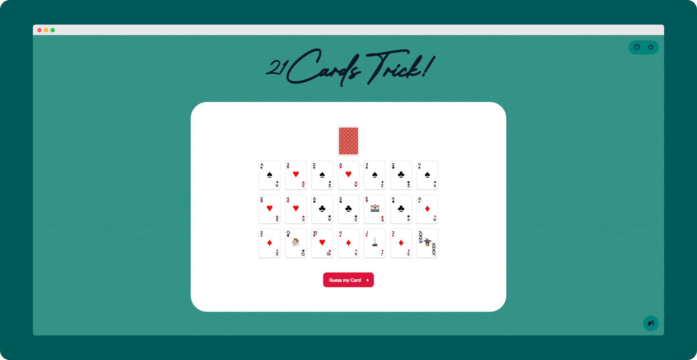

# 🔮 Telepath - 21 Cards Magic Trick

## How to Play

- On the first screen, choose any card and keep it in your mind. Once chosen, click "Guess My Card"!
- On the following screens, you will be asked 3 times to select the column containing your card!
- After the third selection, your secret card will be magically revealed!

## Credits & Assets

- Fredoka font from [Google Fonts](https://fonts.google.com/)
- Vector Icons from [SVGRepo](https://www.svgrepo.com/)
- Sound effects modified for immersive card dealing experience

## License

Telepath is open-source software licensed under the [MIT License](../../LICENSE.md).
